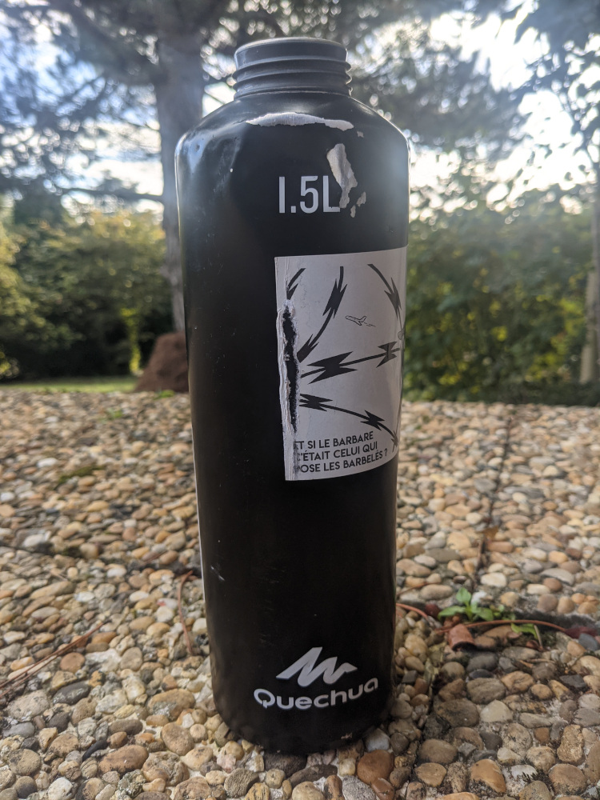

# Quechua Bottle 500 replacement cap

This is an OpenSCAD project for a replacement cap of the Quechua 500 bottle.



Main object is in [`Quchua-bottle.scad`](./Quechua-bottle.scad), open it in OpenSCAD and render it with `F6` and export it with `F7`.

You'll need a plastic seal of *42.5mm* diameter and *1.5mm* thick with a hole of *33.5mm* diameter inside.
You can tweak theses measurements in the file.

```openscad
// Epaisseur du joint
sealThickness = 1.5;
// Taille du trous du joint
sealHoleDiameter = 33.5;
// Diametre externe du joint
sealOuterDiameter = 42.5;
```